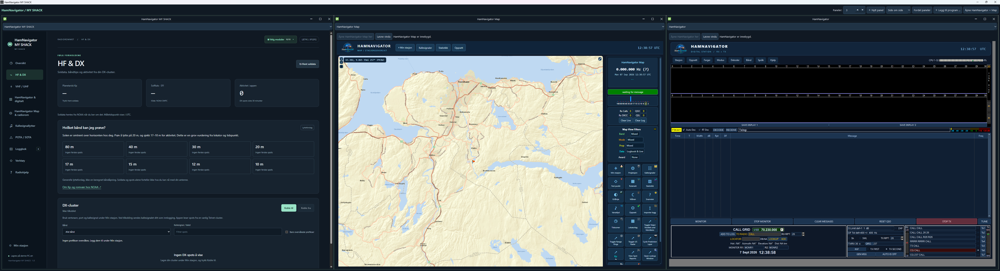

# HamNavigator / MY SHACK

**Din stasjon, samlet.**

HamNavigator MY SHACK samler digitalradio, kart og loggbok i en arbeidsflate du tilpasser selv. Velg antall paneler, innhold og plassering etter hvordan du jobber i shacken eller ute på aktivering.

## Last ned for Windows

**[Last ned HamNavigator MY SHACK for Windows](https://github.com/stianbjerkan/HamNavigator-MY-SHACK/releases/latest/download/HamNavigator-MY-SHACK-Setup.exe)**

[Alle utgivelser og kildekode](https://github.com/stianbjerkan/HamNavigator-MY-SHACK/releases)

- Windows 10/11, 64-bit.
- Komplett installasjon: omtrent 948 MB.
- Python, nødvendige biblioteker og lokal språkmodell følger med.
- Kartfliser og nettjenester trenger internett.

Dobbeltklikk installasjonsfilen. Start deretter **HamNavigator MY SHACK** fra skrivebordet. Legg inn eget kallesignal, lokator, lydkort og radiooppsett før bruk. Drivere til selve radioen installeres separat ved behov.

## Funksjoner

- Digitalradio og dekoding sammen med kart og stasjonsoversikt.
- Fleksible paneler med valgfritt innhold og plassering.
- POTA- og SOTA-kart, aktiveringslogg og lenker til spotting.
- Loggbok med ADIF-eksport.
- Kallesignallytter med forslag du kontrollerer før logging.
- UTC-klokke og verktøy for radioamatører.

## Tilbakemeldinger

Bruk **Issues** på denne siden for feil og forslag. Oppgi programversjon, Windows-versjon og hva som skjedde. Unngå å legge ved private logger, passord eller kontoinnstillinger.

## Utvikling og kildekode

Aktuell Windows-klient ligger i [`windows/`](windows/). Versjon 1.9.16 kobler
Digital, MY SHACK og Map til samme aktive `hamnavigator.adi`. Map følger ikke
lenger gamle `radioassistent.adi`-eksportkopier som app-logg. Kildekodearkivene under
Releases inneholder også tilhørende Digital- og Map-kode og lisenser.
De eldre C#/XAML-filene i roten er WPF-prototypen, ikke MY SHACK-installasjonen.

HamNavigator-utgaven er programmert og designet av **LB7YK – Stian Bjerkan**.

Kildekodevedlegg finnes under Releases. Opphavsopplysninger og komponentlisenser følger programmet og ligger også i `HamNavigator-OPPHAV.txt` og `Map-OPPHAV.txt` her. Lisensene gjelder hver enkelt komponent; denne utgivelsen erstatter ikke disse vilkårene.
